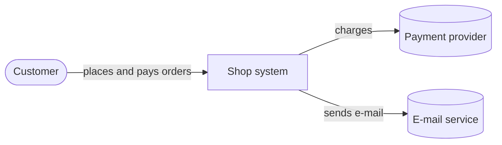
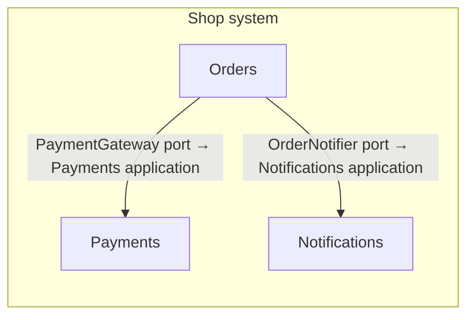
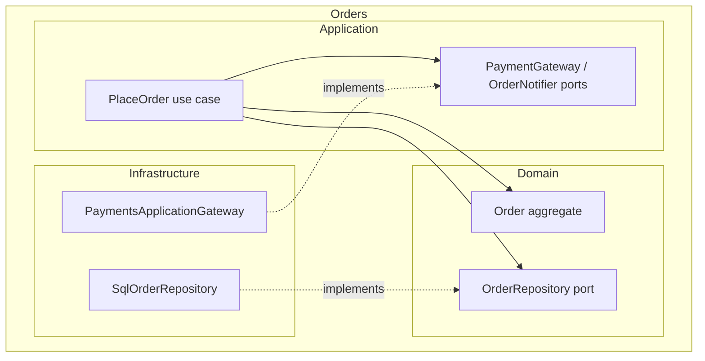

# Orders lab — architecture

The reference the code is compared against. If the code and this document disagree, the code has
drifted. The machine-readable rules are in [architecture-rules.toml](architecture-rules.toml) and
`tools/check_architecture.py` checks them.

## C4 · Level 1 — System context



## C4 · Level 2 — Containers (bounded contexts)



A context talks to another **only through that context's application layer**, and only from its own
infrastructure (an adapter that implements a port the caller declares). See [ADR-0002](adr/0002-contexts-talk-through-application-ports.md).

## C4 · Level 3 — Components of Orders



## Dependency rule

```text
Infrastructure  →  Application  →  Domain
(adapters)         (use cases,      (aggregates, invariants,
                    ports)           domain ports)
```

Dependencies point inward. The domain imports nothing outside the domain — no application, no
infrastructure, no persistence or web framework ([ADR-0001](adr/0001-layered-orders-domain.md)).

| Rule | Statement |
|---|---|
| ARCH-001 | The domain depends on nothing outside the domain. |
| ARCH-002 | The application layer depends on ports, never on infrastructure. |
| ARCH-003 | Orders' domain and application never import another context. |
| ARCH-004 | No context reaches into another context's domain or infrastructure. |

## Domain boundaries

- **Orders** owns the order, its lines, its total and its status transitions (draft → placed → paid,
  or cancelled). Invariants: positive quantities, non-negative prices, no empty order is placed, only
  a draft changes its lines.
- **Payments** owns charging and payment records. Tax rates are a payments-provider concern today.
- **Notifications** owns how customers are told things.
